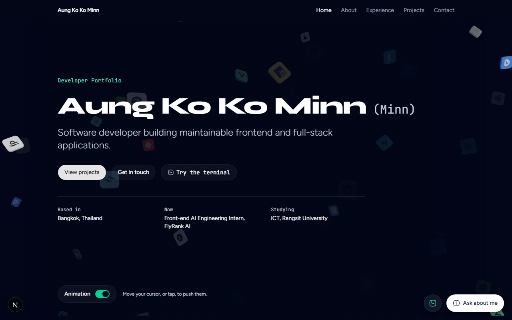
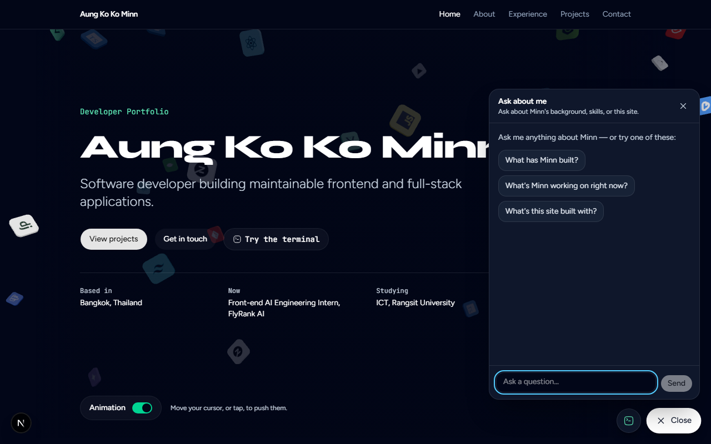
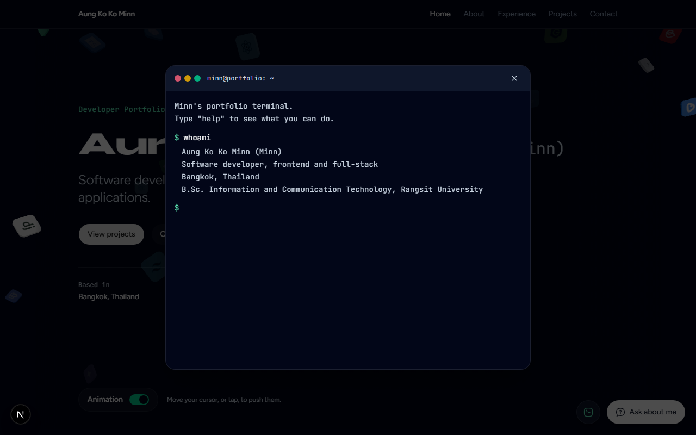
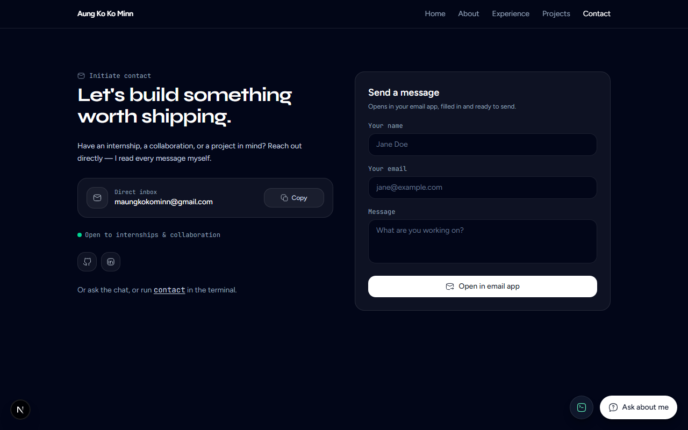

# FlyRank Capstone — Developer Portfolio

A Next.js 16 + React 19 + TypeScript developer portfolio for Aung Ko Ko Minn,
built as the capstone project for the **FlyRank AI Frontend Internship** — a
program practicing professional frontend workflow, from environment setup and
Git hygiene to AI-assisted development with Claude Code.

**Live:** [akkminn.github.io](https://akkminn.github.io) (redirects to the
Vercel deployment).

## Screenshots

| | |
|---|---|
|  |  |
| Home — interactive 3D hero, tech stack, quick links | "Ask about me" — a streaming Gemini-backed chat |
|  |  |
| A terminal easter egg (`whoami`, `projects`, `cd about`, …) | Contact — an honest `mailto:` form, no fake backend |

More pages: [About](docs/screenshots/about.png) ·
[Experience](docs/screenshots/experience.png) ·
[Projects](docs/screenshots/projects.png)

## What it does

A five-page portfolio (Home, About, Experience, Projects, Contact) with three
things that go beyond static content:

- **"Ask about me"** — a streaming AI chat, mounted globally, that answers
  visitor questions about Minn using a system prompt grounded in the site's
  actual content and a `getProjects` tool that looks up real project data
  instead of letting the model invent it.
- **A terminal easter egg** — a small shell (`whoami`, `projects`, `skills`,
  `contact`, `cd <page>`, `open <project>`, `clear`, `exit`, Tab completion,
  arrow-key history) that reuses the same project/tech data as the rest of
  the site, so it can't drift into inventing facts either.
- **An interactive 3D hero** — technology-logo tiles that respond to cursor
  and touch, built with React Three Fiber, with a static SVG fallback for
  reduced motion, low-end devices, and failed chunk loads.

Every "AI knows about me" surface (the chat and the terminal) is fed from the
same two sources — `src/lib/ai/projects-data.ts` and the page content itself —
specifically so the two can't say different things.

## Tech stack

- **Next.js 16** (App Router, Turbopack) with **React 19**
- **TypeScript** (strict)
- **Tailwind CSS v4** (CSS-first config, no `tailwind.config.*`)
- **shadcn**-style UI primitives on `@base-ui/react`, `class-variance-authority` + `tailwind-merge`
- **Vercel AI SDK** (`ai`, `@ai-sdk/react`, `@ai-sdk/google`) for the streaming chat
- **React Three Fiber** + `three` for the 3D hero (no `drei`)
- **@hugeicons/react** for icons
- **Vitest** + **React Testing Library** for unit/component tests, **Playwright** (+ `@axe-core/playwright`) for e2e and accessibility

## Getting started

```bash
git clone https://github.com/akkminn/flyrank-capstone.git
cd flyrank-capstone
npm install
cp .env.example .env.local   # add a Gemini key if you want the chat to work — see below
npm run dev                  # http://localhost:3000
```

The site is fully usable without an API key — every page except the "Ask
about me" chat works out of the box. The chat degrades to a friendly error
message ("can't reach Gemini right now") rather than crashing if the key is
missing or the quota is hit.

## Environment variables

| Variable | Required | Used by | Description |
|---|---|---|---|
| `GOOGLE_GENERATIVE_AI_API_KEY` | Only for the "Ask about me" chat | [`src/app/api/portfolio-chat/route.ts`](src/app/api/portfolio-chat/route.ts) | Server-side Gemini key. Get one free at [aistudio.google.com/apikey](https://aistudio.google.com/apikey). Never exposed to the client — the chat talks to `/api/portfolio-chat`, which holds the key. |

Copy [`.env.example`](.env.example) to `.env.local` (gitignored) and fill it
in. CI and the production build both run without this key — see
[`ci.yml`](.github/workflows/ci.yml).

## Scripts

| Command | What it does |
|---|---|
| `npm install` | Install dependencies |
| `npm run dev` | Dev server (Turbopack, HMR) on `:3000` |
| `npm run build` | Production build — includes type-checking |
| `npm run start` | Serve the production build locally |
| `npm test` | Unit & component tests (Vitest + Testing Library) |
| `npm run test:watch` | Vitest in watch mode |
| `npm run test:e2e` | Playwright (`e2e/`) — builds and serves the app on `:3100`; first run needs `npx playwright install chromium` |
| `npm run typecheck` | `tsc --noEmit` |

## Testing

- **Component tests** (`src/**/*.test.tsx`) cover the chat widget across its
  empty, pending, streaming, error and tool-call states, the composer form's
  validation, the `getProjects` tool-result component (all four lifecycle
  states), the `AsyncActionButton` state machine, and the route error
  boundary. They query by role, label and visible text, so restyling a
  component doesn't break them.
- **Pure logic** (`src/lib/**/*.test.ts`) — the terminal's command table and
  Tab completion, the mailto-link builder, request validation, and the rate
  limiter — is unit-tested directly, no rendering involved.
- **Accessibility** (`e2e/accessibility.spec.ts`) runs axe-core over every
  route (plus the open chat, the open terminal, and the mobile menu) and
  completes the primary flow with the keyboard alone.
- **Playwright** (`e2e/`) walks the primary flow in a real browser: open the
  chat, ask a question, get a reply with a project card, follow it to its
  page — plus an error-then-retry path and a terminal walkthrough.
- **The AI route is always mocked.** Unit tests stub `fetch` (any un-mocked
  call throws — see `vitest.setup.ts`); Playwright intercepts the request
  with `page.route`. Nothing in the suite or CI needs an API key or reaches
  Gemini.
- **CI** ([`.github/workflows/ci.yml`](.github/workflows/ci.yml)) runs
  typecheck, unit tests, the build, and the Playwright suite on every push
  and pull request.

## Architecture overview

```
src/app/                      App Router routes; each renders through <PageContainer>
├── layout.tsx                 Root layout: <Navigation>, page slot, and the
│                               floating launcher dock (terminal + chat)
├── page.tsx, about/, …         One file per route, mostly server components
└── api/portfolio-chat/route.ts  The one server endpoint: streaming chat

src/components/
├── portfolio-chat.tsx          Eager launcher + dialog shell (tiny)
├── portfolio-chat-conversation.tsx   Lazy chunk: useChat + AI SDK UI
├── portfolio-terminal.tsx      Eager launcher + modal shell (tiny)
├── terminal-session.tsx        Lazy chunk: prompt, history, Tab completion
├── hero/                       The 3D scene, its static fallback, and the
│                                capability check that picks between them
└── ui/                         shadcn-style primitives

src/lib/
├── ai/config.ts                 Model list + system prompt (the chat's "brain")
├── ai/tools.ts                  The getProjects tool the model calls
├── ai/projects-data.ts          Single source of truth for project data —
│                                 shared by the chat tool, the terminal, and
│                                 the Projects pages
├── ai/validate-chat-request.ts  Input caps for the chat route (see below)
├── rate-limit.ts                 The chat route's per-IP limiter (see below)
├── terminal-commands.ts          Pure command table + Tab completion
└── build-mailto-href.ts          The Contact page's honest mailto link
```

Two client-heavy features — the AI chat and the 3D hero — are deliberately
kept out of the initial bundle:

- The chat and terminal are each a tiny eager "launcher" component plus a
  `React.lazy` chunk that only loads once the visitor hovers, focuses, or
  touches the launcher (or the page goes idle, for the 3D hero).
- The AI SDK, `three`, and `@react-three/fiber` never ship to a visitor who
  never opens the chat or never gets the 3D scene.

The chat request flow: `ChatConversation` (client) → `useChat` posts to
`POST /api/portfolio-chat` → the route rate-limits and validates the request
→ `streamText` (Vercel AI SDK) tries `gemini-3.6-flash`, falling back to
`gemini-flash-lite-latest` on failure → the model optionally calls
`getProjects` → the response streams back as a UI message stream, rendered
incrementally by `useChat`.

## Key decisions

- **Model fallback, not a single model.** `portfolioChatModels` in
  [`src/lib/ai/config.ts`](src/lib/ai/config.ts) is an ordered list. The free
  Gemini tier rate-limits per model, so a burst of visitors hitting the
  primary model falls through to a second quota pool instead of erroring out.
  The route only advances past a model that actually failed.
- **Honest actions over simulated ones.** The Contact page's message field
  builds a real `mailto:` link ([`build-mailto-href.ts`](src/lib/build-mailto-href.ts))
  instead of showing a fake "Message sent!" state — there's no backend to
  send it, so the UI doesn't claim there is.
- **One data source for anything AI-facing.** `getProjects` (the chat tool)
  and the terminal's `projects` command both read from
  [`projects-data.ts`](src/lib/ai/projects-data.ts) instead of letting the
  model or the terminal improvise. If a project's details change, both
  surfaces change with it.
- **Self-hosted fonts via `next/font/local`, never a Google Fonts `<link>`.**
  An earlier version of the site linked Google Fonts directly, which pushed
  LCP to ~2.4 s; self-hosting removed the network round trip and added a
  size-matched fallback face to avoid layout shift on swap. See
  [AUDIT.md](AUDIT.md).
- **The 3D hero defaults to static on small screens and low-power devices.**
  Rather than trust `prefers-reduced-motion` alone, `src/lib/hero-3d-support.ts`
  also checks device memory, CPU core count, WebGL availability, and screen
  width, so a mid-range phone gets the zero-JS static version by default
  (the visitor can still switch it on).
- **In-memory rate limiting, not a hosted store.** See "Production hygiene"
  below — a deliberate, documented tradeoff for a low-traffic portfolio
  rather than added infrastructure this project doesn't need yet.

## Production hygiene (AI route)

`src/app/api/portfolio-chat/route.ts` is the one endpoint that costs real
money-equivalent (API quota) per request, so it has three guards a static
site doesn't need:

1. **`maxDuration = 30`** — caps a single streaming response at 30 seconds
   (Vercel's serverless default is 10s), long enough for a full reply with a
   tool call, short enough that a stuck request can't run indefinitely.
2. **Per-IP rate limiting** ([`src/lib/rate-limit.ts`](src/lib/rate-limit.ts)) —
   a sliding-window counter, 8 requests per 60 seconds per IP, in memory.
   Over the limit, the route returns `429` with a friendly message and a
   `Retry-After` header instead of forwarding the request to Gemini. This is
   **per server instance, not distributed** — a real limitation on a
   multi-instance serverless deployment, and it resets on cold start. For
   this project's actual traffic (a visitor reading a portfolio, not a
   public API), that's an acceptable, documented tradeoff; a production API
   with real abuse exposure would use an Upstash/Redis-backed limiter
   instead.
3. **Input caps** ([`src/lib/ai/validate-chat-request.ts`](src/lib/ai/validate-chat-request.ts)) —
   a request is rejected (`400`) before it reaches the model if the
   conversation has more than 24 messages, any single message exceeds 4,000
   characters, or the conversation's combined text exceeds 16,000 characters.
   This stops a script from sending an oversized history just to burn quota;
   a real conversation in this widget is a handful of short exchanges.

Both the rate limiter and the request validator are pure, dependency-free
modules with their own unit tests (`rate-limit.test.ts`,
`validate-chat-request.test.ts`) — no mocking the AI SDK required to verify
the guard logic itself.

## Accessibility & performance

Lighthouse (mobile) performance is **92–94 on every page** on a quiet
machine (medians of 3) and accessibility/best practices are 100. The full
before/after, method, and honest caveats about what the numbers do and don't
say are in [AUDIT.md](AUDIT.md). Two decisions worth knowing without reading
the whole audit: the chat's AI SDK loads only when the launcher is
hovered/focused/clicked, and on small screens (under 768px wide) the 3D hero
starts static — the Animation switch turns it on.

## How AI tools built this

This project's explicit brief was practicing **AI-assisted development**, so
here's the honest account rather than a vague "built with AI" line.

- **Claude Code was used throughout**, guided by [`CLAUDE.md`](CLAUDE.md) — a
  project-specific instruction file describing the stack, conventions
  (testing style, comment style, accessibility rules, honest-UI rules) and
  commands, kept up to date as the project evolved. Claude Code read that
  file at the start of every session, which is why the codebase's comment
  style, test conventions, and architecture stay consistent across features
  built weeks apart.
- **Every feature was reviewed, tested, and committed by a human** (Minn).
  Claude Code proposed implementations; nothing merged without the tests
  passing and a manual pass in a real browser (this repo's [CLAUDE.md](CLAUDE.md)
  explicitly requires checking UI changes in a browser, not just trusting a
  green build). Commit messages and authorship are human, not AI-attributed,
  because the human is the one who decided what to ship.
- **[`WORKFLOW.md`](WORKFLOW.md) documents a deliberate experiment** early in
  the project: the same contact-form feature was built twice, once from a
  one-line prompt and once from a detailed, structured prompt that asked the
  model to inspect the project, plan, follow conventions, and write tests.
  The structured branch produced more complete, better-tested, more
  accessible output — the vague branch was still correct, just thinner. That
  finding shaped how prompts were written for every feature after it.
- **Where AI-assisted work needed real correction:** the accessibility and
  performance audit ([`AUDIT.md`](AUDIT.md)) is written in the same
  measure-first spirit — it explicitly calls out cases where a fix didn't do
  what was predicted (self-hosting fonts removed a layout shift but did
  *not* move LCP, contrary to the initial hypothesis) rather than reporting
  only the wins. That audit was itself produced with AI assistance and
  corrected against real Lighthouse runs, not accepted on faith.
- **What AI did not do:** decide product scope, pick the tech stack, or
  determine what counts as "done." Those were Minn's calls, recorded in
  `CLAUDE.md` and enforced by asking Claude Code to follow it.

## License

MIT — see [LICENSE](LICENSE). © 2026 Aung Ko Ko Minn.
